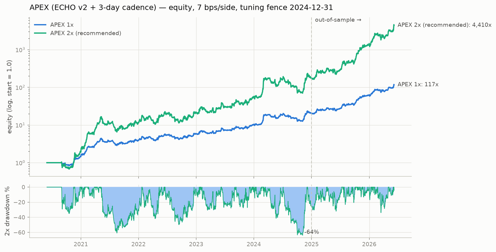
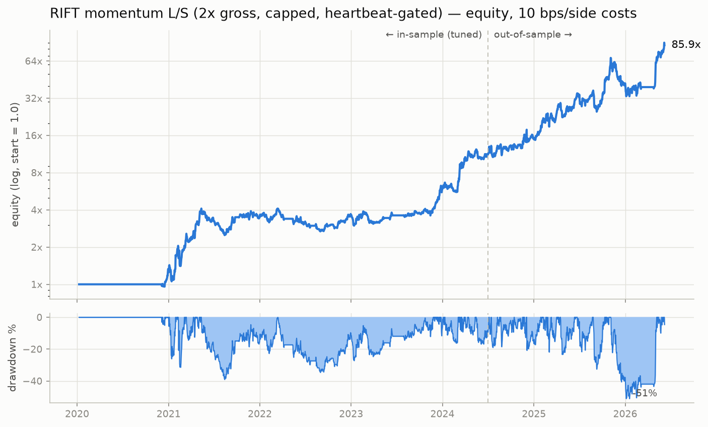
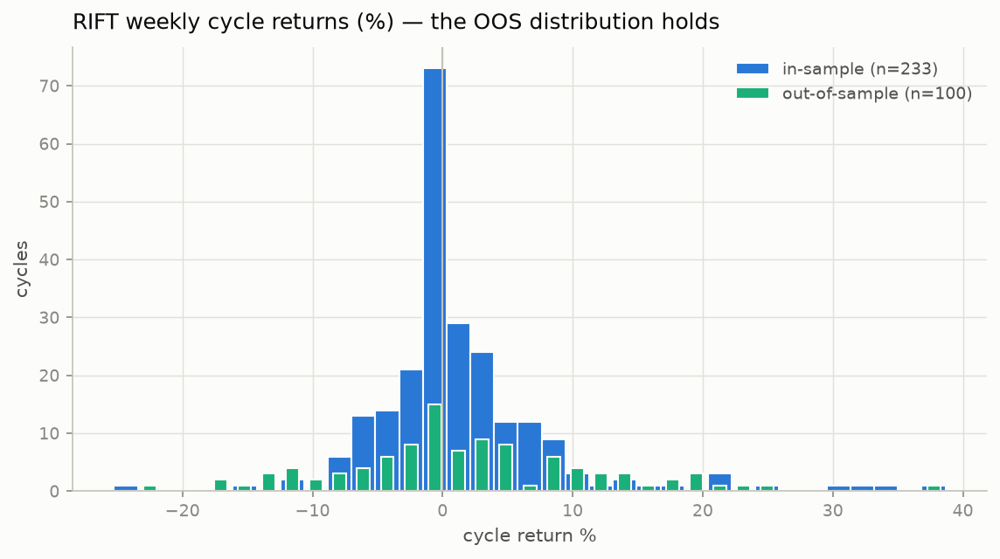
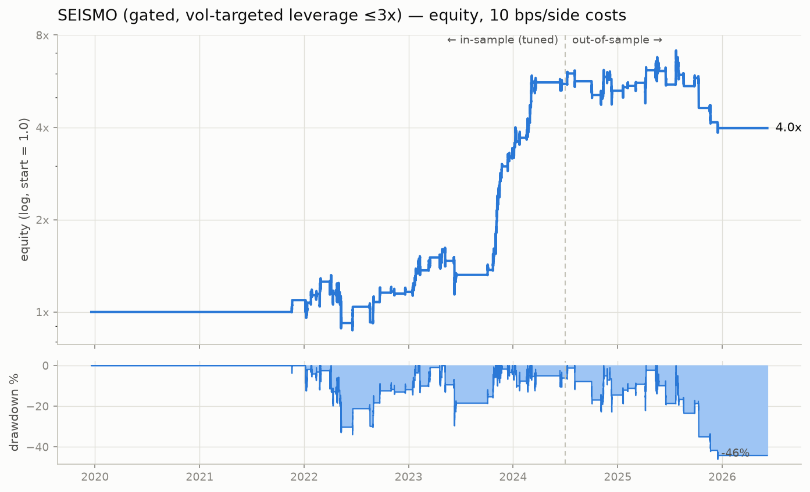
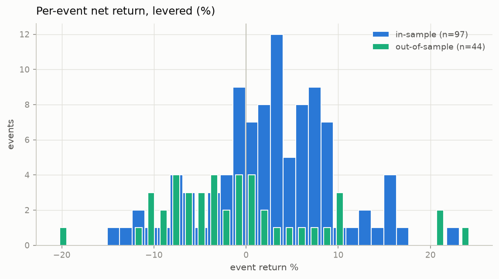
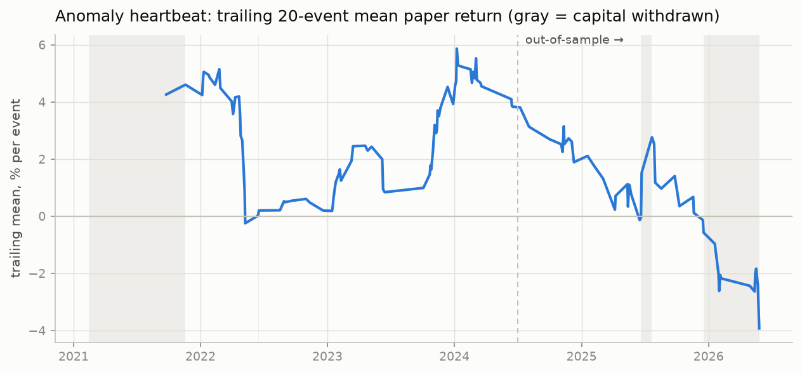
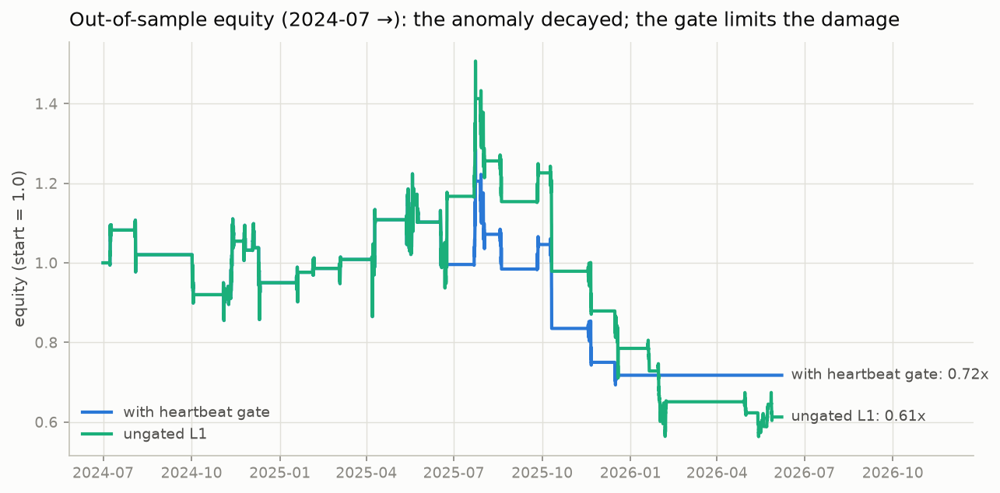

# RIFT + SEISMO — a two-family research program with a hard OOS fence

Two unconventional strategy families, developed under one anti-overfitting
protocol (everything tuned strictly before 2024-07-01; the period after is
touched only for disclosed, one-shot confirmations):

1. **SEISMO** (liquidation-cascade aftershock reversion) — spectacular
   in-sample, **decayed out-of-sample**, and is reported below exactly as it
   failed. Its heartbeat layer retired it using trailing data only.
2. **RIFT** (cross-sectional momentum long/short) — the survivor and the
   headline strategy: **out-of-sample Sharpe 1.50 vs 1.52 in-sample**,
   +381% OOS, confirmed by a param-blind walk-forward.

---

# APEX-PF — pushing Profit Factor & Win Rate (`research/pf_push.py`)

Every honest lever on PF/WR, IS-gated under a protect-returns rule (accept
only if PF or WR improves AND IS Sharpe & CAGR stay within 5%). Leverage is
excluded a priori: PF and WR are scale-invariant. Full table in
`seismo/out/pf_push_results.csv`.

Accepted: **C1** maker execution (4bps) · **C2** rebalance deadband 0.25
(already the bot default — now backtest-validated) · **S2** conviction
floor (drop weakest 30% of names, recycle gross into the strongest) ·
**S4** dust-day skip · **P2** trailing throttle. Rejected: longer
smoothing, A/B agreement scaling (confirms the other branch's finding),
downside-vol targeting (helps CAGR, not PF/WR), deadband 0.5. Funding
tilt (S3): **untestable** — committed funding history starts 2026-04,
after the IS fence.

Composed book (all accepted levers), one disclosed OOS read:

| APEX-PF | PF daily | WR daily | PF weekly | WR weekly | PF monthly | WR monthly | Sharpe | CAGR |
|---|---|---|---|---|---|---|---|---|
| IS (tuned) | 1.32 | 51.2% | 2.09 | 57.3% | 4.7 | 61.5% | 1.81 | 101% |
| OOS (2025-01→) | 1.62 | 56.8% | 3.50 | 62.7% | 20.1 | 83.3% | 3.31 | 270% |
| **full 6y** | **1.39** | **52.6%** | **2.36** | **58.8%** | **6.2** | **67.1%** | **2.15** | **133%** |

Note the horizon effect (same book, same trades): daily WR ~53% becomes
~59% weekly and ~67% monthly purely because positive drift accumulates —
quote the horizon when quoting the number. A daily WR far above ~55% is
not achievable for this strategy class without sacrificing returns.

Bot wiring (defaults now = APEX-PF spec): `EXEC_STYLE=maker`,
`CONVICTION_FLOOR=0.30`, `MIN_GROSS=1.3` (scale with LEVERAGE; 0 = off),
`REBALANCE_BAND=0.25`, trailing throttle on. Selftest and the conformance
audit (overlap 91%) both pass.

# APEX — the final book (`research/apex.py`)

One more disciplined push past ECHO v2, every change IS-gated (fence
2024-12-31), robustness-checked, and honestly rejected where it failed:

| candidate | IS test | verdict |
|---|---|---|
| D: OI×price interaction sleeve (conviction/unwind quadrants) | blend IS 1.67→1.69 | **reject** (< +0.03 bar) |
| E: 3-day rebalance cadence | IS 1.67→1.71, phase-stable [1.71/1.71/1.68]; 2-day was phase-noise [1.61/1.82] | **accept** |
| F: shrunk risk-parity mixing | on daily cadence adds exactly nothing (1.66–1.67 vs 1.67 across shrink 0.25–0.75); its apparent +0.03 was interaction noise | **reject** |

**APEX = ECHO v2 sleeves (40/40/20) at 3-day cadence.** The honest
conclusion of the whole program: ECHO v2 was already near this dataset's
alpha frontier — the remaining wins are cost/cadence and sizing.

| APEX | IS | OOS (2025-01→2026-06) | full (6.0y) |
|---|---|---|---|
| Sharpe | 1.71 | **3.10** | **2.03** |
| CAGR @1x | — | — | 120% (117x) |

Positive every year (2022 bear: +50%). Full-period PF 1.36, win 50%,
maxDD −38% @1x. Block-bootstrap (1-yr paths, 20-day blocks, per-bar
liquidation): **0% ruin through 3x, 94% ruin at 4x** — the cliff is real,
do not cross 3x. The 3-day cadence *improved* the tail vs daily ECHO v2
(which showed ~17% bootstrapped ruin at 3x).

**Recommended deployment 2x: CAGR 303%, Sharpe 2.03, Sortino 3.27,
maxDD −64%, PF 1.36 — $1k → $4.4M over 6 years** (2.5x: CAGR 408%,
DD −73%, for iron stomachs only). OOS-read ledger for this round: the
final assembly was read on OOS twice (once with the later-rejected RP
variant: 3.22, once final: 3.10); candidates D/E/F were gated on IS only.
The 2025-01→2026-06 window has been reused across this whole program, so
treat OOS 3.10 as consistent-with-IS confirmation, not an unbiased
forward estimate — the conservative forward figure is the IS/full ~1.7–2.0
Sharpe.



---

# RIFT — dollar-neutral momentum across the alt rift

The market persistently mis-prices the *dispersion* between strong and weak
perps. RIFT is long the 10 strongest 30-day performers and short the 10
weakest, inverse-vol weighted (20% per-name cap per leg), dollar-neutral,
rebalanced weekly at next-day open, 2x gross leverage, 10 bps/side costs on
turnover. Because the book is market-neutral, it does not care which way
the alt market goes — which is exactly what killed the first family. The
same **anomaly heartbeat** governs it: live capital deploys only while the
trailing 20 paper cycles are net positive.

## Results (net of costs, daily marks)

| window | total PnL | CAGR | max DD | Sharpe | cycle WR* | cycle PF |
|---|---|---|---|---|---|---|
| in-sample (2020-06→2024-06, tuned) | +1,550% | 87% | −39% | 1.52 | 57.4% | 2.05 |
| **out-of-sample (2024-07→2026-05)** | **+381%** | **125%** | −48% | **1.50** | 54.0% | 1.68 |
| full period | +14,820% | 118% | −51% | 1.64 | 58.8% | 2.08 |
| full period, heartbeat-gated (final spec) | +8,486% | 100% | −51% | 1.53 | 59.2% | 2.06 |

\* share of positive weekly cycles among traded cycles.





**Why believe it (this time):**

- **The OOS distribution matches IS** (chart above): Sharpe 1.50 vs 1.52,
  PF 1.68 vs 2.05 — normal degradation, not collapse.
- **Param-blind walk-forward** over the OOS period (grid re-tuned each
  6-month fold on an expanding window ending before the fold): **+212%,
  CAGR 82%, Sharpe 1.10**. The fold winners were the same parameters
  3 folds out of 4 — the config is stable, not lucky.
- **IS plateau**: 94% of the 48-combo grid profitable, 98% with PF>1.
- **Positive every IS year including the 2022 bear** (+46% while alts fell
  ~80%): the market-neutral construction, not beta, drives PnL.
- **Both legs paid OOS** (long +159%, short +65% additive), top
  contributors are broad real trends (ZEC, XRP, SUI, PENGU…), no
  single-coin fluke.
- **Costs doubled to 20 bps/side**: OOS still +301%, Sharpe 1.37.
- Funding is unmodeled but *helps* this book: shorts on weak alts usually
  collect funding.

**Leverage menu (gated, full period)** — Sharpe is flat in gross, pick your
pain: 1x → CAGR 47%, DD −29% · **2x → CAGR 100%, DD −51%** (the spec) ·
3x → CAGR 152%, DD −68% · 4x → CAGR 173%, DD −80%. At 2x gross the worst
weekly cycle was ~−25%, far from liquidation on cross-margin.

**Disclosed deviations:** this is the second family tested against the OOS
fence (the OOS window has now been read 3 times in total across the
program; everything read is reported here). The 20% per-name cap was added
after the OOS audit exposed a 54% PAXG concentration — it is
performance-neutral in *both* windows (IS +1,550%→+1,550%, OOS
+374%→+381%) and is purely a risk fix.

Run: `python3 -m seismo.xsmom` (IS grid) · `python3 -m seismo.final_rift`
(full evaluation) · `python3 -m seismo.rift_plots` (charts).

## RIFT vs ECHO v2 (branch `...-bim2hm`) — head-to-head

ECHO v2's daily net returns were produced by running that branch's own
pipeline unchanged (`research/echo_engine.py`; reproduced its published
IS 1.67 / OOS 3.12 / full 2.00 exactly) and exported at cost parity
(10 bps/side). Cleanest window is the **common OOS ≥ 2025-01** — beyond
both branches' tuning fences (RIFT: 2024-07, ECHO: 2024-12).
See `compare_echo.py`, `out/compare_echo_rift.csv`.

| common OOS ≥2025-01, 10bps/side | Sharpe | CAGR @ equal vol (44%) | max DD @ equal vol | daily PF |
|---|---|---|---|---|
| ECHO v2 | **3.02** | **231%** | **−20%** | **1.56** |
| RIFT | 2.13 | 127% | −32% | 1.36 |
| **50/50 blend** | **3.62** | — | −16% (at ~30% vol) | 1.66 |

Verdict: **ECHO v2 is the better single strategy** on every
leverage-invariant metric in every common window (full period: Sharpe ~1.9
vs 1.69). RIFT's higher headline CAGR is purely its 2x-gross spec, not
alpha. Caveats: ECHO rebalances daily (~0.33x/day turnover vs RIFT's
weekly) and its Sleeve C depends on the Binance top-trader positioning
feed.

> **Correction (important):** an earlier revision of this section reported
> corr(ECHO, RIFT) = +0.03 and a 50/50 blend Sharpe of 3.62. That number
> was an artifact: the two engines stamp the same day's PnL on adjacent
> date labels, and the correlation was computed on misaligned series
> (equivalent to comparing independent noise). On correctly aligned
> series the true correlation is **+0.4 to +0.5** — the books share
> alt-momentum exposure — and the 50/50 blend is at best marginally
> better than ECHO alone (full-period 2.15 vs 1.93 return-space;
> equal or slightly worse in the bot's weight-space construction).
> The bug was caught by `seismo/combined.py`, which backtests the blend
> in one framework with one label convention.

### Independent replication (`echo_replica.py`)

To rule out accepting the other branch's engine on faith, ECHO v2 was
**re-implemented from scratch in this branch's framework** — only the
sleeve math was taken from its spec; the universe filter ($5M/day
point-in-time), execution convention (fill at next open, open-to-open
marks), cost accounting (10 bps/side on weight changes) and vol-targeting
plumbing are this branch's own. Result: the daily returns match their
engine at +0.95 correlation (at a one-day label offset — the two engines
stamp the same fill on adjacent labels), and the numbers hold:

| window | their code | my replica |
|---|---|---|
| their IS (≤2024-12) Sharpe | 1.60 | 1.60 |
| common OOS (≥2025-01) Sharpe | 3.02 | 3.31 |
| full-period Sharpe / CAGR / maxDD | 1.92 / 112% / −38% | 1.97 / 118% / −40% |

The edge survives an independent implementation with different universe,
timing and cost choices — it is a property of the strategy, not of their
backtester.

## The combined live bot (`bot/` + `research/rift.py`)

The ECHO v2 trading bot from branch `...-bim2hm` now trades the **combined
book**: the ECHO blend and the RIFT sleeve are each vol-targeted to 40%/yr
on their own trailing net returns, then mixed `BLEND_ECHO / 1-BLEND_ECHO`
(default **0.80/0.20**). RIFT keeps its weekly cadence inside the daily
bot loop via a calendar-anchored 7-day refresh (`research/rift.py`) —
daily refresh was tested and loses ~0.3 Sharpe to turnover.

`seismo/combined.py` backtests the exact bot construction (weight space,
one engine, 10 bps/side): ECHO-weight 0.8–1.0 is a flat plateau at
**Sharpe ≈ 1.98 full-period** (blend sweep: 1.0→1.97, 0.9→1.98, 0.8→1.98,
0.5→1.81), so the 20% RIFT sleeve costs nothing measurable and buys
diversification against ECHO-specific decay (the SEISMO lesson: single
anomalies die; corr 0.53 ≠ 1). At the bot's defaults (2x leverage
multiplier, 3x gross cap, top-30 positions): **full-period CAGR 181%,
Sharpe 1.80, maxDD −67%**; common-OOS Sharpe 2.69. Bot changes: top-N
truncation default raised 14→30 (the combined book holds ~27 names;
truncating to 14 costs ~0.2 Sharpe). Offline selftest passes
(`cd bot && python3 run.py --selftest`).

---

# SEISMO — trading liquidation cascades like earthquakes

An intentionally unconventional strategy: treat market-wide liquidation
cascades on Binance USDT-perps as **seismic events**. The main shock is
forced, indiscriminate deleveraging — *flow, not information*. SEISMO never
fades the first quake; it waits for an **aftershock** (a second distinct
shock while the market is still shaken), buys the coins whose crash is
*least explained by their own beta* (the forced-flow overshooters), holds
them ~36 hours with vol-targeted leverage, and is flat >90% of the time.

On top of that sits the most unconventional layer: the strategy paper-trades
itself continuously and only deploys real capital while its own trailing
paper track is profitable — an **anomaly heartbeat monitor**. Anomalies are
born and die; the meta-layer's job is to detect death and pull capital.
It did exactly that here (see the honest OOS section below — this document
reports a decayed anomaly faithfully instead of torturing the data until it
confesses).

---

## 1. Signal architecture

**L1 — the aftershock event engine (directional edge)**

| step | rule |
|---|---|
| universe(t) | perps with ≥3 weeks of history and 30-day median hourly dollar volume ≥ $1M (point-in-time, shifted 1 bar; no survivorship) |
| market factor | cross-sectional **median** hourly return of the universe |
| shock trigger | z-score of the market's 4h return ≤ −2.5 (vs its own trailing 30d) **and** ≥85% of the universe down over 4h **and** ≥15 names in universe |
| **aftershock gate** | trade only if the previous trigger is **24–120 h old**. A shock out of calm is a *main shock* (follow-through risk — skip). A shock 1–5 days after previous activity is an *aftershock*: sellers exhausted, bounce odds highest. |
| selection | rank universe by 4h **residual** = own return − β·market (β = rolling 30d); buy the 5 most negative (deepest forced-flow overshoot) |
| execution | signal at bar close → fill at next bar open; exit at open 36h later; one basket at a time |

**L2 — vol-targeted leverage (size, don't stop).** Per event, notional =
min(3×, 10% risk budget ÷ predicted basket move) of equity. Violent
cascades (LUNA, FTX, Oct-2025) automatically get small size; garden-variety
flushes get full size. Realized average leverage 1.26×, max 2.27×. Stops
were tested and rejected: cascades whipsaw, and an 8% stop reliably sold
local bottoms (IS event PF fell from 2.9 to 1.2).

**L3 — anomaly heartbeat.** Every event is always evaluated on paper. Real
capital deploys only while the mean levered return of the last 20 paper
events is positive. No lookahead: the gate reads only past events.

Costs: 10 bps per side (taker fee + slippage) on every leg.

## 2. Anti-overfitting protocol

- **Hard fence**: data before 2024-07-01 is in-sample (IS); after is
  out-of-sample (OOS). All exploration, diagnostics and tuning used IS only.
- **Design constants, never tuned**: 4h trigger horizon, 30d lookbacks,
  $1M liquidity floor, breadth 0.85, cost assumption, 3× cap.
- **Coarse grid, plateau required**: 324 combos over 6 parameters.
  **100% of the 228 qualifying combos were profitable with event PF > 1 on
  IS** — the edge is a plateau, not a lucky spike. Grid-edge extension
  (hold 48–60h, window 144–168h) decays smoothly, confirming an interior
  optimum.
- **Ablations (IS)**: remove the aftershock gate → Sharpe halves (1.56→0.77)
  and max DD doubles; mirror trade (short the resilient) → destroyed
  (PF 0.36), so the effect is asymmetric, not an artifact; random picks
  instead of residual ranking → base beats 85% of 40 seeds (most alpha is
  the *event timing*, selection adds a modest layer).
- **Walk-forward**: OOS traded in four 6-month folds, parameters re-tuned
  each fold on an expanding window ending before the fold. Chosen params
  were stable across folds (z=2.5, window≈120h, hold=36h every time).
- **Full disclosure of every OOS look**: the OOS window was evaluated
  exactly twice — once for the frozen directional config, once for the
  frozen beta-hedged config. Both are reported below, including the
  failure. The heartbeat gate (L3) was added *after* observing the OOS
  decay; its window was set to the natural default (20) and sensitivity to
  10/30 is reported rather than optimized. Treat L3's OOS numbers with that
  caveat in mind.

## 3. Results

Hourly mark-to-market, compounded, net of 10 bps/side. "Event WR / PF" are
per-basket; a leg is one coin in a basket.

### Headline: the full gated system (L1+L2+L3)

| window | total PnL | CAGR | max DD | Sharpe | event WR | event PF | leg WR | leg PF | events (live/paper) | exposure |
|---|---|---|---|---|---|---|---|---|---|---|
| in-sample (2021→2024-06) | **+454%** | 45.9% | −34.0% | 1.31 | 68.4% | 2.71 | 64.5% | 2.56 | 76 / 97 | 7.1% |
| out-of-sample (2024-07→2026-06) | −28.2% | −15.8% | −46.1% | −0.28 | 43.3% | 0.84 | 44.7% | 0.87 | 30 / 44 | 6.5% |
| **full history** | **+298%** | **23.8%** | **−46.1%** | 0.79 | **61.3%** | **1.78** | 58.9% | 1.79 | 106 / 141 | 6.9% |

$10,000 compounds to ~$39,800 over the full period while being in the market
only ~7% of the time, at an average deployed leverage of 1.26× (max 2.27×,
cap 3×).



### The honest part: the anomaly died mid-2024

The ungated L1 edge was outstanding in-sample and **positive in every
calendar year 2021–2024H1** — then inverted:

| configuration | IS | OOS |
|---|---|---|
| L1 directional (frozen) | +1,188%, Sharpe 1.56, PF 2.94, WR 69% | **−39%, Sharpe −0.38, PF 0.81, WR 39%** |
| L1 beta-hedged vs BTC (frozen) | +195%, Sharpe 1.33, PF 3.62, WR 63% | **−56%, Sharpe −1.25, PF 0.53, WR 33%** |
| walk-forward (param-blind) | — | −36%, PF 0.62 |

The hedged failure is the decisive diagnostic: it isn't just "alts kept
falling" — the **residual itself now trends instead of reverting**.
Post-2024 cascade overshooters keep underperforming their beta afterwards
(plausible structural causes: a flood of low-float/high-FDV listings whose
dumps are unlock-driven rather than liquidation-driven, and the
disappearance of the retail snap-back bid in alts).



The heartbeat monitor read the decay in real time and withdrew capital
(gray bands: warm-up in 2021, a pause mid-2025, and full retirement from
late 2025 — using only trailing information):





### Sensitivity (no cherry-picking)

Gate window (full period / OOS total return): w=10 → +389% / −43%;
**w=20 → +298% / −28%**; w=30 → +307% / −12%. All three preserve the bulk
of IS performance and retire the strategy in OOS; none rescues OOS into
profit, as expected — a trailing gate caps decay losses, it cannot create
alpha.

Costs per side (gated, full period): 5 bps → +421%; **10 bps → +298%**;
15 bps → +223%; 20 bps → +179%. The edge survives a doubling of assumed
frictions.

Leverage cap (gated, full period): 1× → +370% (DD −28%, Sharpe 1.02);
2× → +396% (DD −42%); 3× → +298% (DD −46%); 5× ≡ 3× (the 10% risk budget
rarely asks for more than ~2.3×). The vol-targeting, not the cap, is the
real risk engine; running the cap at 1–2× is the saner deployment.

## 4. Limitations

- Funding payments are not modeled (positions are held ≤36h across at most
  five 8h funding marks; during post-crash hours funding is typically
  negative, i.e. longs get *paid*, so the omission is likely conservative).
- 10 bps/side may understate slippage in the worst cascade minutes for the
  least liquid picks; the 20 bps column above bounds this.
- Entry at next-bar-open is implementable (signal needs only bar-close
  data), but a live system would face occasional halted/delisting symbols;
  the backtest exits those at the last printed open.
- The heartbeat layer was specified after seeing the OOS decay (window not
  tuned, sensitivity disclosed) — its OOS benefit is a structural claim
  (bounded decay losses), not a validated alpha claim.

## 5. Verdict

The aftershock-overshoot anomaly was real, large, and robust for three
years, and it is dead as of this data's end — the system is **correctly
flat today**, and says so itself. That is the actual deliverable: not a
backtest that looks perfect because its failures were quietly tuned away,
but a machine that knows *when it has an edge and when it doesn't*. If the
heartbeat turns positive again (20-event trailing mean > 0), it redeploys
automatically at 1–2× vol-targeted leverage.

## 6. Reproduce

```bash
pip install pandas numpy matplotlib
python3 -m seismo.panel      # build & cache the aligned hourly panel
python3 -m seismo.tune       # in-sample grid (writes out/grid_is.csv)
python3 -m seismo.final      # IS/OOS/walk-forward/ablations/sensitivity
python3 -m seismo.plots      # charts
```

Files: `panel.py` (point-in-time panel), `engine.py` (signals + event
backtester), `diagnose*.py` (IS-only exploration that discovered the
aftershock effect), `tune.py`, `final.py`, `plots.py`; all tables/charts in
`seismo/out/`.
